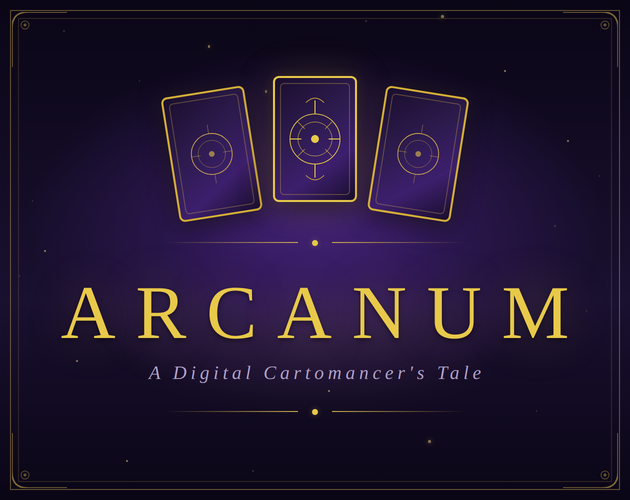

# Arcanum: A Digital Cartomancer's Tale



This is the open-source repository for **Arcanum**, the flagship demo game for the **[Bardic](https://github.com/katelouie/bardic)** interactive fiction engine.

> ## For Players: Play the Game
>
> **You don't need to download any code.** The full game is free to play in your browser right now on Itch.io.
>
> ### [Play *Arcanum* on Itch.io](https://katehlouie.itch.io/arcanum)

-----

## For Developers: About This Repository

This repository is a complete, open-source example of what you can build with the **[Bardic](https://github.com/katelouie/bardic)** engine. It's designed to be a "batteries-included" project that you can download, run, and learn from.

It demonstrates how Bardic uses Python-first principles to build complex, data-driven narrative games.

### Features Showcased

This demo isn't just a simple story; it's a showcase of Bardic's core power:

* **Object-Oriented Storytelling:** See how custom Python classes like `Card`, `Client`, and `Session` are imported and used directly in the narrative to manage state.
* **Complex State Management:** Go beyond simple variables. This game tracks client trust, reputation, money, full tarot spreads, and branching story flags.
* **Reusable Logic:** Uses **passage parameters** to create reusable, data-driven passages for client readings.
* **Custom UI Integration:** Shows how Bardic's tags (`^UI:DASHBOARD`) and `@render` directives can control a NiceGUI frontend.
* **Full Save/Load System:** A working example of a persistent save manager.

## Design Patterns Showcased

* **Structured Randomness**: Deck depletion/reshuffle for bounded procedural generation
* **Data-Driven Narrative**: Card meanings in JSON, dynamically composed interpretations
* **Object-Oriented State**: Custom Python classes (Card, Spread, Client) used directly in narrative
* **Emergent Storytelling**: Combinatorial interactions create authored-feeling but systematic narratives
* **Natural Progression**: Domain mastery (learning cards) = mechanical mastery

## Getting Started (Running Locally)

### Prerequisites

* Python 3.12+
* `pyenv` (recommended)

### Installation & Running

```bash
# 1. Create and activate a virtual environment
pyenv virtualenv 3.12 arcanum
pyenv activate arcanum

# 2. Install dependencies
pip install -r requirements.txt

# 3. Compile the story
# This reads the .bard files and creates the final .json story file
bardic compile stories/arcanum/main.bard -o compiled_stories/arcanum.json

# 4. Run the player
python player/nicegui_player.py
```

Once running, just open your browser to **`http://localhost:8080`** to play the game locally.

## Project Structure

Here are the most important files to look at:

```sh
arcanum-game/
├── player/
│   ├── nicegui_player.py   # The main NiceGUI frontend. This is what you run.
│   └── save_manager.py       # A Python-based save/load system.
├── game_logic/
│   └── tarot.py              # Custom Python classes (Card, Client) imported by Bardic.
├── stories/arcanum/
│   ├── main.bard             # The main story entry point.
│   ├── prologue.bard         # The game's introduction.
│   ├── chen/                 # The full text and logic for Margaret Chen's arc.
│   └── nyx/                  # The full text and logic for Nyx's arc.
├── compiled_stories/
│   └── arcanum.json          # The final, compiled JSON that the player runs.
├── assets/                   # Images, card meanings, etc.
└── requirements.txt         # Python dependencies
```

## Built With Bardic

This entire game is powered by **[Bardic](https://github.com/katelouie/bardic)**, a Python-first interactive fiction engine built for writers who want more power and developers who love narrative.

If you're interested in making your own game, you can get started in seconds:

```bash
pip install bardic
bardic init my-game
```

## Credits

* **Engine:** [Bardic](https://github.com/katelouie/bardic)
* **UI Framework:** [NiceGUI](https://nicegui.io/)
* **Styling:** [Tailwind CSS](https://tailwindcss.com/)
* **Icons:** [vectorsmarket15](https://www.flaticon.com/free-icons/tarot) via Flaticon
* **Card Images:** Sourced from public domain resources.
